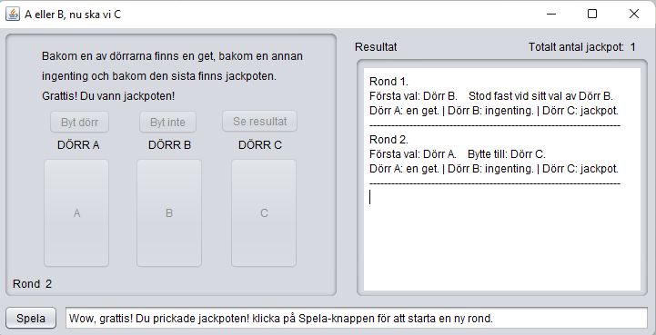

[ENG](#monty-hall-game-java-gui) | [SV](#monty-hall-spel-java-gui)

# Monty Hall Game (Java GUI)

A simulation of the classic probability puzzle known as the Monty Hall Problem, implemented with a graphical interface in Java.

*Screenshot from the game showing the interface and game flow.*

## Features
- The player selects one of three doors
- The game reveals one of the other doors
- The player can choose to stay or switch door
- The result is revealed and logged
- **User interface language: Swedish**

## Documentation
The project includes a PDF report (in Swedish) discussing the Monty Hall problem and presenting results from running the simulation using different strategies:
- [rapport.pdf](rapport.pdf)

## How to Run
1. Open a terminal in the `src` folder  
2. Compile the code:

   javac A_Uppgift.java

3. Run the program:

   java A_Uppgift

## Notes
- This project was completed as an optional A-level assignment in a programming course, 
available only to students who passed the final exam with a high enough grade.
- Uses only built-in Java libraries (Swing)

## License
This project is licensed under the MIT License – see the [LICENSE](LICENSE) file for details.

---

# Monty Hall-spel (Java GUI)

En simulering av det klassiska sannolikhetsproblemet "Monty Hall", byggt i Java med grafiskt gränssnitt.

## Funktioner
- Spelaren väljer en av tre dörrar
- En av de resterande dörrarna avslöjas
- Spelaren kan välja att stanna kvar eller byta dörr
- Resultatet visas och loggas
- **Gränssnittets språk: Svenska**

## Dokumentation
Projektet innehåller en PDF-rapport som diskuterar Monty Hall-problemet och redovisar resultat från simuleringar med olika strategier.
- [rapport.pdf](rapport.pdf)

## Så här kör du spelet
1. Öppna terminalen i `src`-mappen  
2. Kompilera koden:

   javac A_Uppgift.java

3. Kör programmet:

   java A_Uppgift

## Kommentarer
- Detta projekt gjordes som en frivillig A-uppgift i en programmeringskurs. 
Uppgiften var endast tillgänglig för studenter som klarade slutprovet med tillräckligt högt betyg.
- Använder endast standardbibliotek (Swing)

## Licens
Detta projekt är licensierat under MIT License – se [LICENSE](LICENSE)-filen för detaljer.
